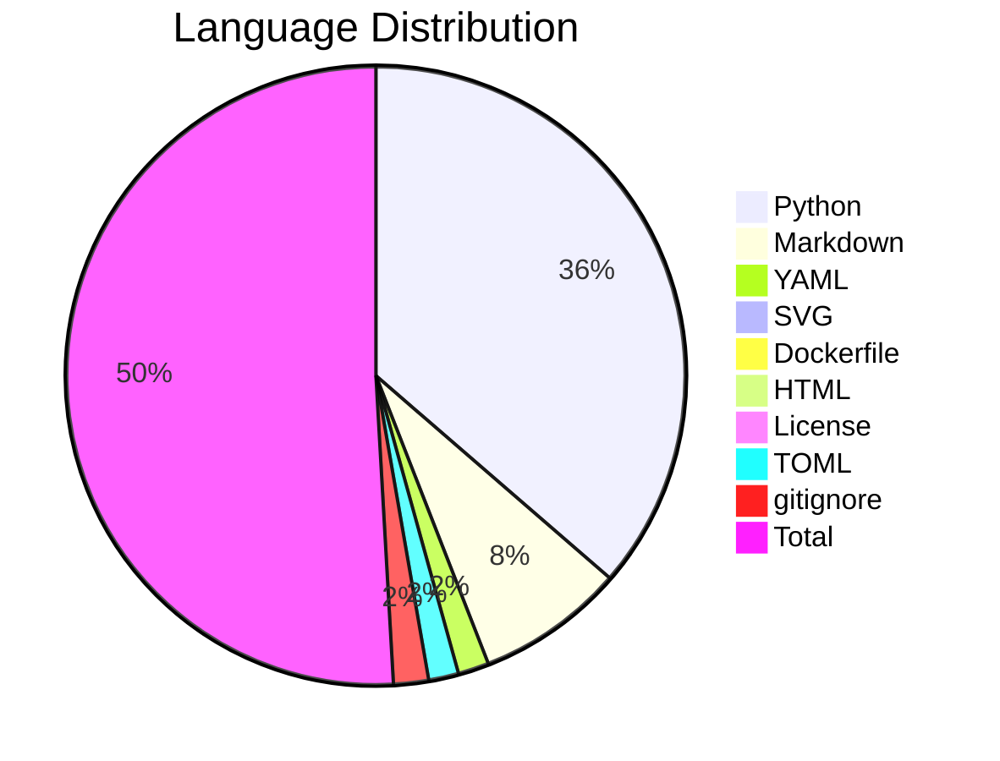
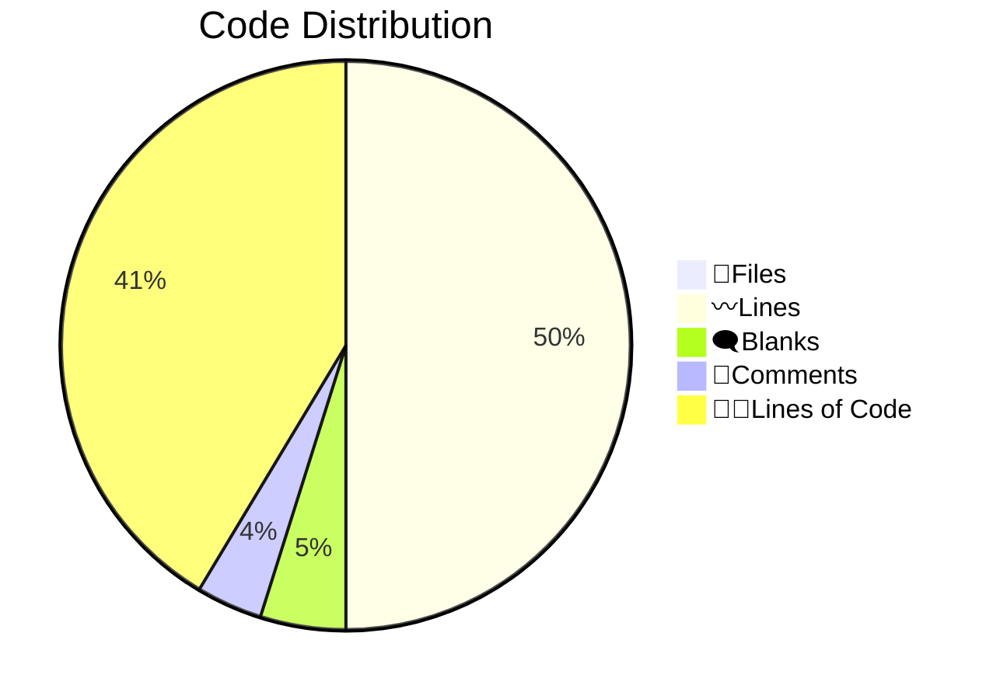

# 📊 Code Statistics for {PROJECT_NAME}

## 👨‍💻Languages
||📝Files|〰️Lines|🗨️Blanks|🙈Comments|👨‍💻Lines of Code|
| :---: | :---: | :---: | :---: | :---: | :---: |
|Python|23|1819|134|156|1529|
|Markdown|7|394|69|0|325|
|YAML|3|68|0|0|68|
|SVG|2|38|0|0|38|
|Dockerfile|1|13|5|0|8|
|HTML|1|13|0|0|13|
|License|1|21|4|0|17|
|TOML|1|82|12|4|66|
|gitignore|1|138|27|34|77|
|Total|40|2586|251|194|2141|