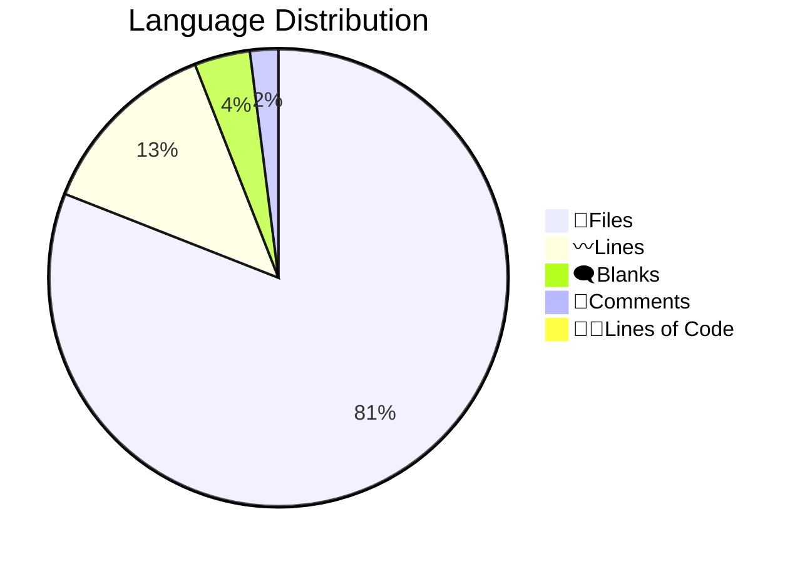

# 📊 Code Statistics for PyNetic
  

## 👨‍💻Languages

||Python|Markdown|YAML|SVG|Dockerfile|HTML|License|TOML|gitignore|
| :---: | :---: | :---: | :---: | :---: | :---: | :---: | :---: | :---: | :---: |
|📝Files|23|5|3|2|1|1|1|1|1|
|〰️Lines|1819|306|75|38|7|13|21|82|138|
|🗨️Blanks|129|56|0|0|3|0|4|12|27|
|🙈Comments|145|0|0|0|0|0|0|7|34|
|👨‍💻Lines of Code|1545|250|75|38|4|13|17|63|77|
  

## Totals

|📝Files|〰️Lines|🗨️Blanks|🙈Comments|👨‍💻Lines of Code|
| :---: | :---: | :---: | :---: | :---: |
|38|2499|231|186|2082|
  
