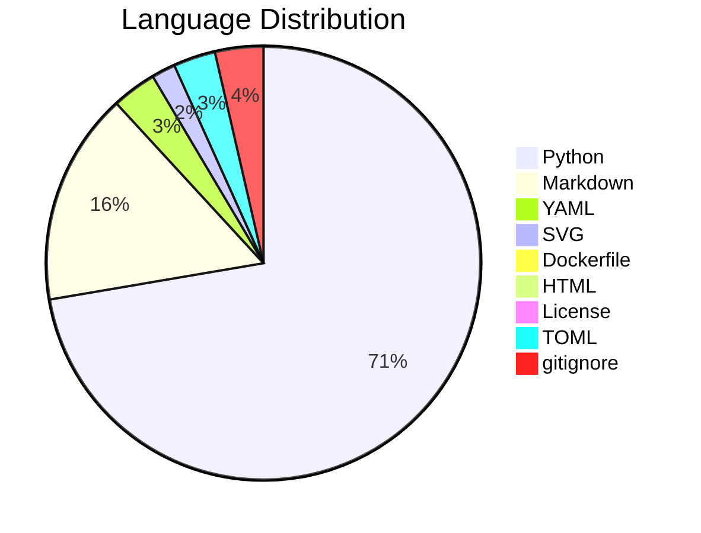

# 📊 Code Statistics for PyNetic

## 👨‍💻Languages

|            | 📝Files | 〰️Lines | 🗨️Blanks | 🙈Comments | 👨‍💻Lines of Code |
| :--------: | :-----: | :-----: | :------: | :--------: | :-------------: |
|   Python   |   23    |  1844   |   140    |    158     |      1546       |
|  Markdown  |    7    |   458   |   119    |     0      |       339       |
|    YAML    |    3    |   73    |    2     |     0      |       71        |
|    SVG     |    2    |   38    |    0     |     0      |       38        |
| Dockerfile |    1    |   13    |    5     |     0      |        8        |
|    HTML    |    1    |   13    |    0     |     0      |       13        |
|  License   |    1    |   21    |    4     |     0      |       17        |
|    TOML    |    1    |   83    |    12    |     4      |       67        |
| gitignore  |    1    |   138   |    27    |     34     |       77        |
|   Total    |   40    |  2681   |   309    |    196     |      2176       |
