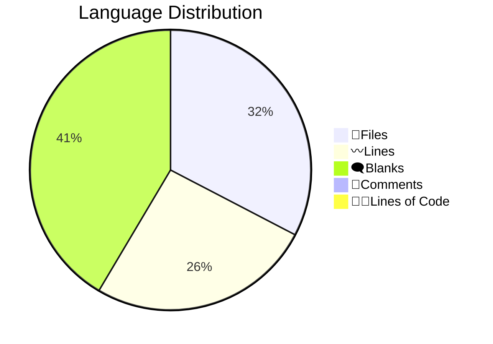

# 📊 Code Statistics for PyNetic
  

## 👨‍💻Languages

||TypeScript|Vue|YAML|JavaScript|SVG|JSON|Markdown|Sass|TypeScript Typings|gitignore|License|Docker ignore|Dockerfile|CSS|HTML|Makefile|TOML|XML|Total|Python|Markdown|YAML|SVG|Dockerfile|HTML|License|TOML|gitignore|
| :---: | :---: | :---: | :---: | :---: | :---: | :---: | :---: | :---: | :---: | :---: | :---: | :---: | :---: | :---: | :---: | :---: | :---: | :---: | :---: | :---: | :---: | :---: | :---: | :---: | :---: | :---: | :---: | :---: |
|📝Files|917|374|214|47|43|31|29|22|21|16|7|2|2|1|1|1|1|1|1730|23|7|3|2|1|1|1|1|1|
|〰️Lines|83536|64056|92324|1059|652|4215|7337|2620|162|204|4718|15|110|412|39|27|10|9|261505|1813|405|72|38|13|13|21|83|138|
|🗨️Blanks|10733|8542|2203|91|0|0|1043|372|18|37|847|3|23|67|4|5|2|0|23990|129|80|0|0|5|0|4|12|27|
|🙈Comments|2708|3|1043|57|1|0|0|48|5|32|0|0|34|1|0|0|0|0|3932|145|0|0|0|0|0|0|7|34|
|👨‍💻Lines of Code|70095|55511|89078|911|651|4215|6294|2200|139|135|3871|12|53|344|35|22|8|9|233583|1539|325|72|38|8|13|17|64|77|
  

## Totals

|📝Files|〰️Lines|🗨️Blanks|🙈Comments|👨‍💻Lines of Code|
| :---: | :---: | :---: | :---: | :---: |
|40|2596|257|186|2153|
  
