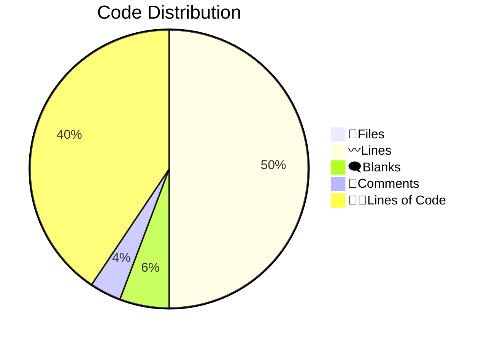

<!-- prettier-ignore-start -->
<!-- SOMETHING AUTO-GENERATED BY TOOLS - START -->
# 📊 Code Statistics for PyNetic

## 👨‍💻Languages

||📝Files|〰️Lines|🗨️Blanks|🙈Comments|👨‍💻Lines of Code|
| :---: | :---: | :---: | :---: | :---: | :---: |
|Python|23|1849|140|158|1551|
|Markdown|7|462|119|0|343|
|YAML|3|72|2|0|70|
|SVG|2|38|0|0|38|
|Dockerfile|1|13|5|0|8|
|HTML|1|13|0|0|13|
|License|1|21|4|0|17|
|TOML|1|83|12|4|67|
|gitignore|1|138|27|34|77|
|Total|40|2689|309|196|2184|

<!-- SOMETHING AUTO-GENERATED BY TOOLS - END -->
<!-- prettier-ignore-end -->