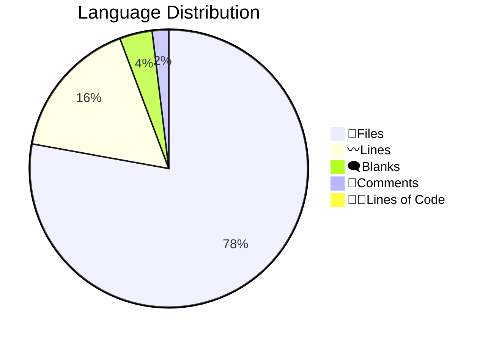

# 📊 Code Statistics for PyNetic
  

## 👨‍💻Languages

||Python|Markdown|YAML|SVG|Dockerfile|HTML|License|TOML|gitignore|
| :---: | :---: | :---: | :---: | :---: | :---: | :---: | :---: | :---: | :---: |
|📝Files|23|7|3|2|1|1|1|1|1|
|〰️Lines|1813|405|75|38|13|13|21|83|138|
|🗨️Blanks|129|80|0|0|5|0|4|12|27|
|🙈Comments|145|0|0|0|0|0|0|7|34|
|👨‍💻Lines of Code|1539|325|75|38|8|13|17|64|77|
  

## Totals

|📝Files|〰️Lines|🗨️Blanks|🙈Comments|👨‍💻Lines of Code|
| :---: | :---: | :---: | :---: | :---: |
|40|2599|257|186|2156|
  
