# 📊 Code Statistics for PyNetic

```mermaid  
pie title Language Distribution  
    "📝Files" : 1524  
    "〰️Lines" : 325  
    "🗨️Blanks" : 68  
    "🙈Comments" : 38  
    "👨‍💻Lines of Code" : 8  
```  
  

## 👨‍💻Languages

||Python|Markdown|YAML|SVG|Dockerfile|HTML|License|TOML|gitignore|
| :---: | :---: | :---: | :---: | :---: | :---: | :---: | :---: | :---: | :---: |
|📝Files|23|7|3|2|1|1|1|1|1|
|〰️Lines|1814|405|68|38|13|13|21|82|138|
|🗨️Blanks|134|80|0|0|5|0|4|12|27|
|🙈Comments|156|0|0|0|0|0|0|4|34|
|👨‍💻Lines of Code|1524|325|68|38|8|13|17|66|77|
  

## Totals

|📝Files|〰️Lines|🗨️Blanks|🙈Comments|👨‍💻Lines of Code|
| :---: | :---: | :---: | :---: | :---: |
|40|2592|262|194|2136|