# 📊 Code Statistics for PyNetic
  

  

  
  

  

  

```mermaid  
pie title Code Distribution  
    "📝Files" : 4
    "〰️Lines" : 260
    "🗨️Blanks" : 25
    "🙈Comments" : 19
    "👨‍💻Lines of Code" : 215
```  

## 👨‍💻Languages
  

||📝Files|〰️Lines|🗨️Blanks|🙈Comments|👨‍💻Lines of Code|
| :---: | :---: | :---: | :---: | :---: | :---: |
|Python|23|1820|134|156|1530|
|Markdown|7|410|69|0|341|
|YAML|3|68|0|0|68|
|SVG|2|38|0|0|38|
|Dockerfile|1|13|5|0|8|
|HTML|1|13|0|0|13|
|License|1|21|4|0|17|
|TOML|1|82|12|4|66|
|gitignore|1|138|27|34|77|
|Total|40|2603|251|194|2158|
  
