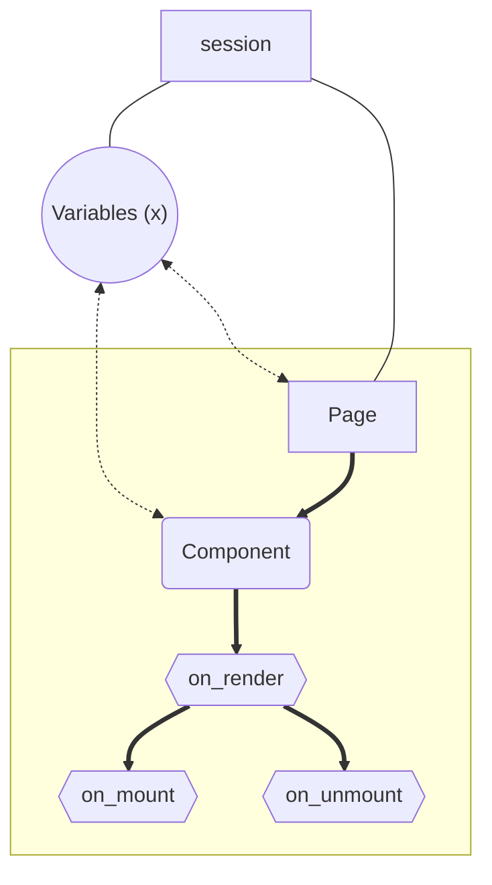

# ‼️Note
This is a work in progress, and as the project matures this file is subject to change.

This outlines the structure of pynetic and it's intended usage.

## 🗄️File structure (example)

```
site-name
├── Components
│   ├── card.py
│   └── ...
└── Routes
    ├── index.py
    ├── about.py
    └── ...
```

## 📊Lifecycle Diagram



## 🤔Things to know
1. HTML `class`'es and `id`'s will be managed and assigned by pynetic as needed.
  - This can be done manually as well but is not needed. [This is useful if you're using a css framework (ex: tailwind)]
  - __**Cases where a class will be added to a tag**__
      - Any time a style is assigned to an element
      - Any time there is an event assigned to an element
      - ...
2. Variables (aka: `state`'s in react) are automatically bound to the session
  - Variables are bound using `Context` context-manager
  - Variables can be accessed from the page or other components using import statements
  - Variables can be used at any time during the session
  - Variables must have distinct names from any other name in the project as they are assigned the name they are given on instantiation
3. All possible HTML and CSS is dynamically created at Render stage
  - Whatever cannot be rendered will be rendered client side during on_mount

## 💻Example Code:

### `index.py`
```Python
from pynetic import Page
from card import card

# notice same name as filename
# this will be what is rendered
index = Page(
    h1("Welcome to my page"),
    card,
)
```

### `card.py`

```Python
from pynetic.html import div, span, form, label, b, p, button, Input

with Context():
  username: str = "John"

def is_email_valid(element):
    element.style(
        color = "red" if ("." in element.value or len(element.value) < 8) else "black"
    )

def when_mounted(element):
    pass

def submit_form(element):
    pass

custom_div = div(
    f"Welcome {username}",
).style(
    background_color="green"
)

card = Component(
    div(
        "Hi there ",
        span(username, "",),
        form(
            label("Gimme ur info"),
            Input(
                "First Name",
                on_change=is_email_valid,
            ),
            button("Submit", on_click=submit_form),
        ),
        custom_div, # named div tag defined outside the Component
        div(
            "The",
            b(p("blue").style(color="car")), # this style will be automatically managed by pynetic
        ),
        on_mount=when_mounted, # this will be caught by the component

    ).style(
        position= "absolute"
    )
)
```
