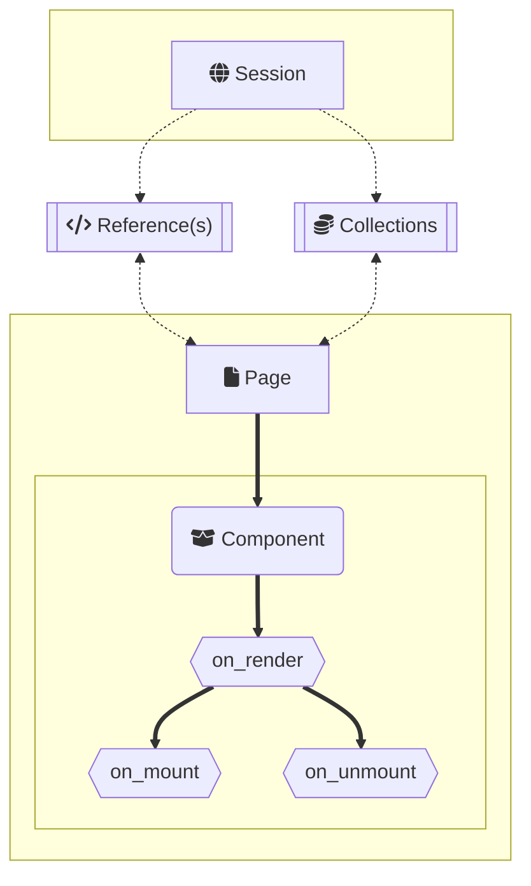

<p align="center">
  <a href="https://github.com/Jabbey92/PyNetic">
    
  </a>
</p>

# ‼️Note

### <ins>🚧 PyNetic is currently a work in progress, as the project matures this file is subject to change.</ins>

---

## 📖 Outline

- **HTML `class`'es and `id`'s will be managed and assigned by PyNetic as needed.**

  - This can be done manually as well but is not needed. **This is useful if you're using a css framework (ex: tailwind)**
  - **Cases where a class will be added to a tag**
    - Any time a style is assigned to an element
    - Any time there is an event assigned to an element

- **References (aka: `state`'s in react) are automatically bound to the session**

  - References must have distinct names from any other name in the project as they are assigned the name they are given on instantiation
  - References are bound using `MakeReference` context-manager
    - Can be accessed from any page component using import statements
    - Can be used at any time during the session

- **Collections are similar to stores in Svelte.**
  - At their core they are a list of objects
  - They can also be subclassed to interact with a backend or API
  - All possible HTML and CSS is dynamically created at Render stage
  - Whatever cannot be rendered will be rendered client side during on_mount

### Also read: [PyNetic's Philosophy]()

---

## 🗄️File structure (example)

This outlines the structure of PyNetic and it's intended usage.

```
site-name
├── Components
│   ├── card.py
│   └── ...
└── Routes
    ├── index.py
    ├── about.py
    └── ...
```

## 📊Lifecycle Diagram



## 💻Example Code:

### `index.py`

```Python
from PyNetic import Page, h1
from card import card

# notice this is the same name as the filename. this will be what is rendered
index = Page(
    h1("Welcome to my page"),
    card,
)
```

### `card.py`

```Python
from PyNetic import MakeReference
from PyNetic.html import Component, div, span, form, label, b, p, button, input_

with MakeReference():
  username: str = "John"

def is_email_valid(element):
    element.style(
        color = "red" if ("." in element.value or len(element.value) < 8) else "black"
    )

def when_mounted(element):
    pass

def submit_form(element):
    pass

custom_div = div(
    f"Welcome {username}",
).style(
    background_color="green"
)

card = div(
    "Hi there ",
    span(username, ""),
    form(
        label("Gimme ur info"),
        input_(
            on_change=is_email_valid,
        ),
        button("Submit", on_click=submit_form),
    ),
    custom_div, # div tag defined outside the Component
    div(
        "The",
        b(p("blue").style(color="car")),  # this style will be automatically managed by PyNetic
    ),
    on_mount=when_mounted, # this will be caught by the component

).style(
    # either this
    position = "absolute"
    # or this
    position.absolute  # plan is to be able to use this syntax as well as defining css separately, including in another file
)
```
