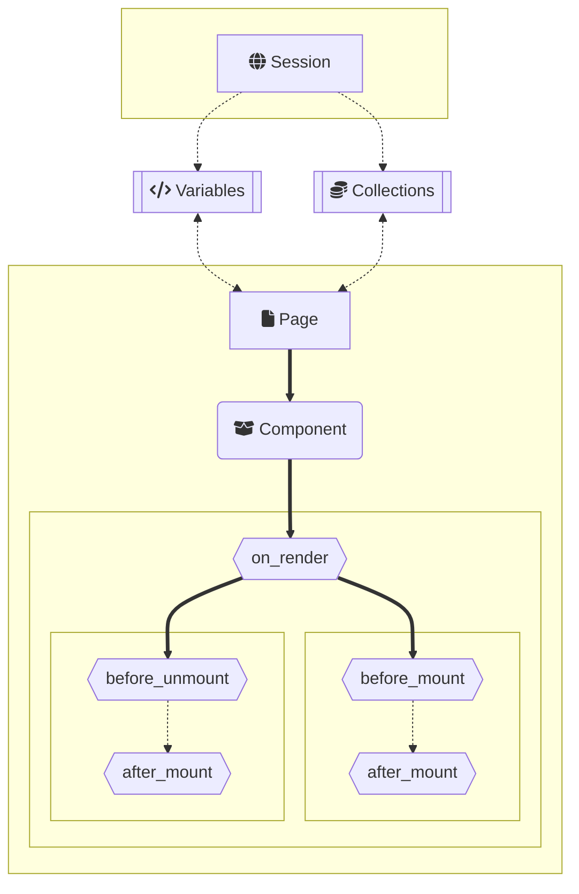

# ‼️Note
This is a work in progress, and as the project matures this file is subject to change.

## 🤔Things to know
- __HTML `class`'es and `id`'s will be managed and assigned by pynetic as needed.__
  - This can be done manually as well but is not needed. **This is useful if you're using a css framework (ex: tailwind)**
  - **Cases where a class will be added to a tag**
    - Any time a style is assigned to an element
    - Any time there is an event assigned to an element

- __Variables (aka: `state`'s in react) are automatically bound to the session__
  - Variables must have distinct names from any other name in the project as they are assigned the name they are given on instantiation
  - Variables are bound using `Context` context-manager
    - Can be accessed from any page component using import statements
    - Can be used at any time during the session

- __Collections are similiar to stores in Svelte.__
  - At their core they are a list of objects
  - They can also be subclassed to interact with a backend or API
  - All possible HTML and CSS is dynamically created at Render stage
  - Whatever cannot be rendered will be rendered client side during on_mount

## 🗄️File structure (example)
This outlines the structure of pynetic and it's intended usage.

```
site-name
├── Components
│   ├── card.py
│   └── ...
└── Routes
    ├── index.py
    ├── about.py
    └── ...
```

## 📊Lifecycle Diagram



## 💻Example Code:

### `index.py`
```Python
from pynetic import Page
from card import card

# notice same name as filename
# this will be what is rendered
index = Page(
    h1("Welcome to my page"),
    card,
)
```

### `card.py`

```Python
from pynetic.html import div, span, form, label, b, p, button, Input

with Context():
  username: str = "John"

def is_email_valid(element):
    element.style(
        color = "red" if ("." in element.value or len(element.value) < 8) else "black"
    )

def when_mounted(element):
    pass

def submit_form(element):
    pass

custom_div = div(
    f"Welcome {username}",
).style(
    background_color="green"
)

card = Component(
    div(
        "Hi there ",
        span(username, "",),
        form(
            label("Gimme ur info"),
            Input(
                "First Name",
                on_change=is_email_valid,
            ),
            button("Submit", on_click=submit_form),
        ),
        custom_div, # div tag defined outside the Component
        div(
            "The",
            b(p("blue").style(color="car")), # this style will be automatically managed by pynetic
        ),
        on_mount=when_mounted, # this will be caught by the component

    ).style(
        position= "absolute"
    )
)
```
